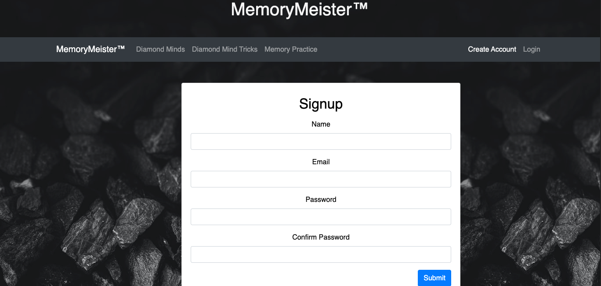
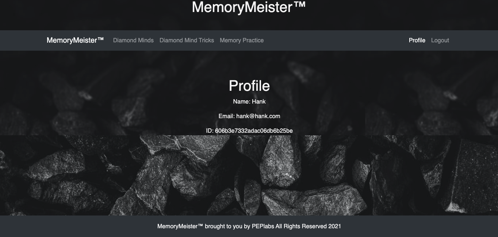

# MemoryMeister™ 

# Concept

 MemoryMeister™ is a proof of concept to deploy a mobile app to help people improve their memory.

 # Usage

# Sign-up

The sign-up page is where the user creates a username and password for their account.

# Profile

The profile page displays the users account info

# Landing

The landing page introduces users to the concept of a "Diamond Mind", one which is focused, clear, and open to make intuitive leaps all around having a good memory.

# Diamond Mind Tricks

The Diamond Mind Tricks page shows users some methods and ways to improve their memory.

# Memory Practice

The Memory Practice page hald thirty cards face down. The user must flip the cards over (They return to being face down within three seconds.) and recall where the matching card is to keep the pair face up. The countdown is sixty seconds. The objective is to match all of the f pairs (fifteen of them) within that time.
